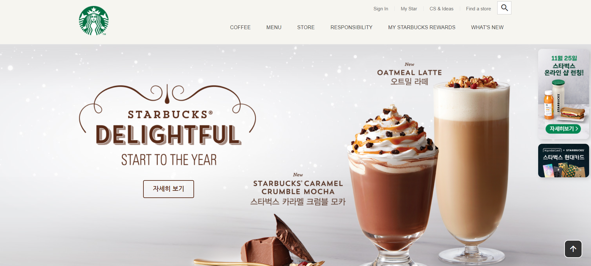
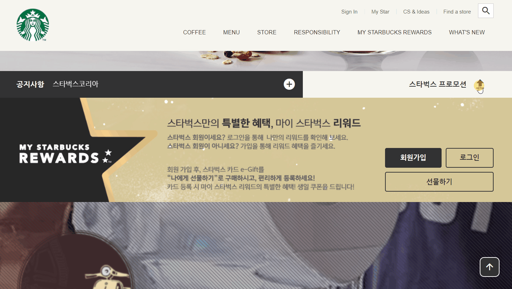

# 스타벅스 CSS Practice

1. 만든 사이트  
      
    
    
    
2. 배포url : [URL](https://jolly-vacherin-3c9b90.netlify.app/)
    
    
3. 사용한 라이브러리와 구현한 기능들

- 라이브러리: swiper, gsap(scrollTo, scrollMagic), lodash, youtubeApi

- 기능들 : 오픈그래프, 트위터카드, 각종 css 젼환 기능들
   
   

4. 사용한 툴

- html / css / javascript
- 외부저장소 github
- 베포 netlify
